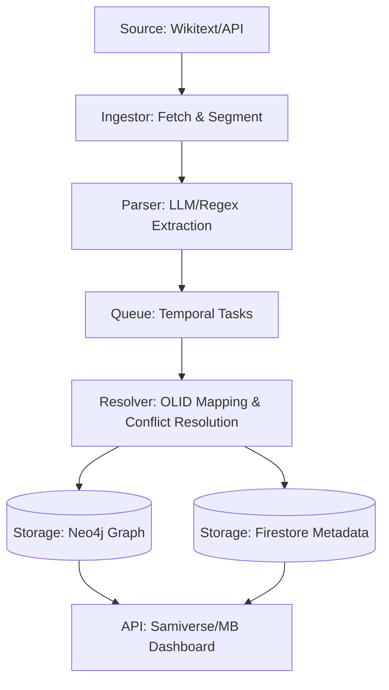

# OLN: System Architecture & Data Flow (Wave 2)

## Overview
The Open Lore Network (OLN) is a federated knowledge graph for fictional universes. This document outlines the ingestion, resolution, and storage pipeline on Motherbrain.

## System Diagram (Conceptual)

## Key Components

### 1. Ingestor (Fetcher)
- Responsibility: Efficiently crawl or stream changes from source (e.g., Wookieepedia).
- Tech: Python/Node.js with MediaWiki API.

### 2. Parser (Extractor)
- Responsibility: Convert unstructured Wikitext/HTML into structured entity/relation JSON.
- Tech: Hybrid Regex + LLM (local Ollama or GPT-4o-mini for precision).

### 3. Resolver (OLID Authority)
- Responsibility: Assign stable Open Lore IDs (OLIDs) to unique entities.
- Rule: "Luke Skywalker" from Wookieepedia and "Luke Skywalker" from another source must resolve to the same OLID if identity matches.

### 4. Storage (Neo4j + Firestore)
- Neo4j: Relationship heavy (A "born on" B, C "mentions" D).
- Firestore: Document heavy (Full biography text, metadata flags).

## Data Flow
1. **Source Update**: Change detected on source wiki.
2. **Segmentation**: Page divided into sections (Metadata/Infobox, Narrative, Chronology).
3. **Entity Extraction**: Extract entities (Characters, Locations, Events, Vehicles).
4. **Link Resolution**: Map wiki-links to potential OLIDs.
5. **Conflict Check**: New data vs existing record logic.
6. **Final Commit**: Update Neo4j nodes/edges and Firestore docs.

## Initial Target: Star Wars (SWLN)
- Source: Wookieepedia.
- Goal: Map the first 10,000 entities to a stable graph.
